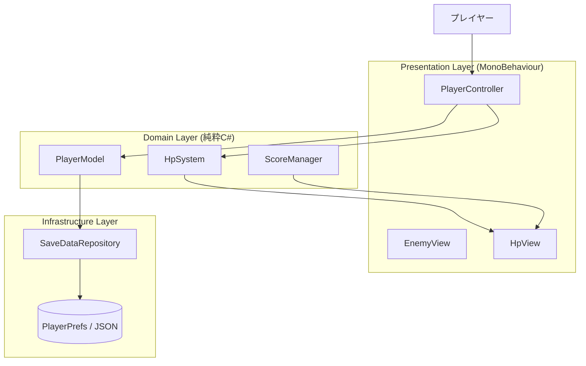
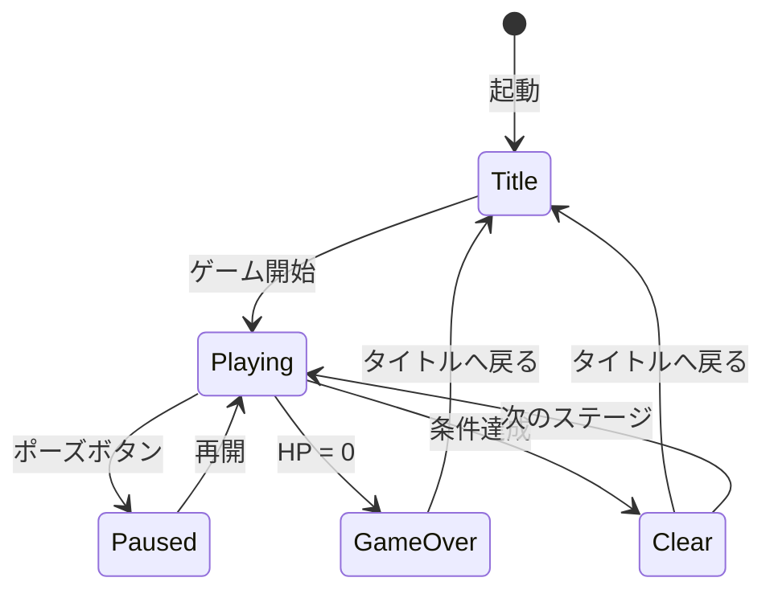
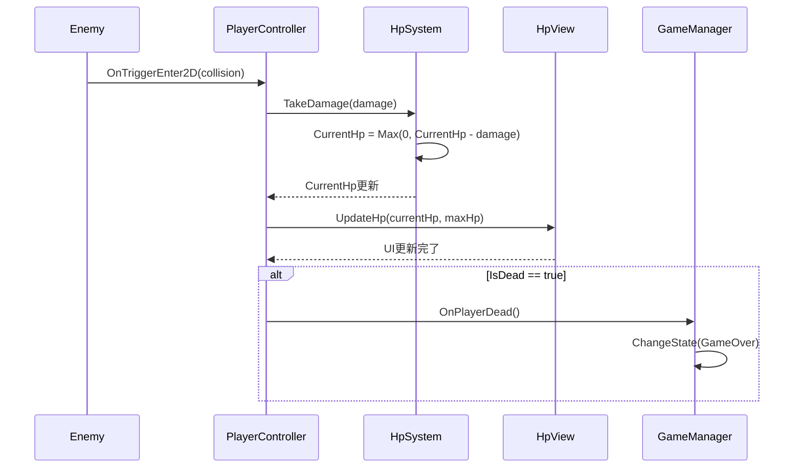
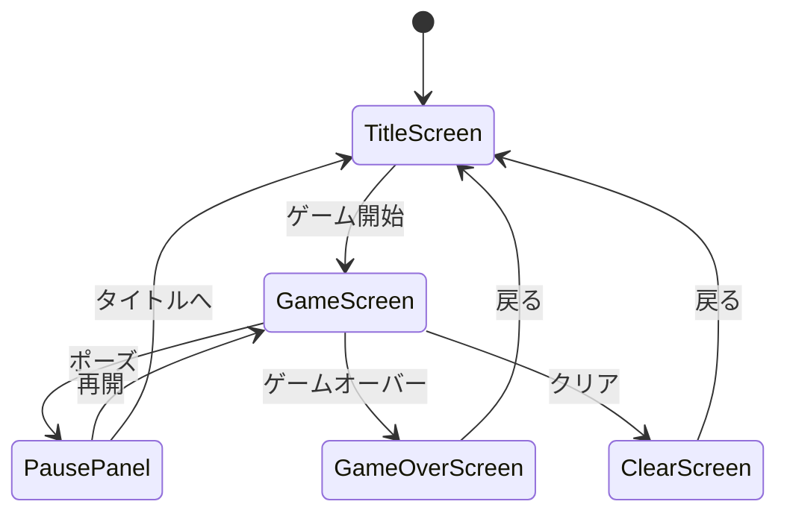

# 機能設計書作成ガイド - Unity

このガイドは、PRDに基づいてUnityゲームの機能設計書を作成するための実践的な指針です。

## 機能設計書の目的

機能設計書は、PRDで定義された「何を作るか」を「どう実現するか」に落とし込むドキュメントです。

**Unityゲームにおける主な内容**:
- システム構成図（Presentation / Domain / Infrastructure レイヤー）
- データモデル（C#クラス・ScriptableObject定義）
- コンポーネント設計（MonoBehaviour・純粋C#クラスの責務）
- ゲームステートマシン（シーン遷移・ゲームフロー）
- アルゴリズム設計（ゲームメカニクスのロジック）
- シーン階層（GameObject構成）
- UI設計（画面構成・画面遷移）
- エラーハンドリング
- テスト戦略（EditModeテストの対象）

---

## 作成の基本フロー

### ステップ1: PRDの確認

機能設計書を作成する前に、必ずPRDを確認します。

```bash
Read('docs/product-requirements.md')
Read('CLAUDE.md')
```

優先度P0（MVP）の機能に焦点を当てて設計します。

---

### ステップ2: システム構成図の作成

Unityゲームの3層アーキテクチャをMermaid記法で記述します。



**ポイント**:
- Domain層（純粋C#）とPresentation層（MonoBehaviour）を明確に分離する
- 依存の方向は上から下のみ（Domain層はPresentation層に依存しない）

---

### ステップ3: データモデル定義

C#クラス・構造体・ScriptableObjectで定義します。TypeScriptのインターフェースではなくC#で記述します。

**Domain層のデータクラス（純粋C#）**:
```csharp
// ゲームのコアデータ（UnityEngine非依存）
[Serializable]
public class PlayerData
{
    public int Level;          // プレイヤーレベル（1以上）
    public int TotalScore;     // 累計スコア（0以上）
    public float PlayTime;     // 総プレイ時間（秒）
    public string LastPlayedAt; // 最終プレイ日時（ISO 8601形式）
}
```

**ScriptableObjectによるゲームパラメータ定義**:
```csharp
// ゲームパラメータをScriptableObjectで管理（インスペクターで調整可能）
[CreateAssetMenu(fileName = "PlayerSettings", menuName = "Game/PlayerSettings")]
public class PlayerSettings : ScriptableObject
{
    [Header("HP")]
    public int MaxHp = 100;
    public float HpRecoveryRate = 5f; // HP/秒

    [Header("移動")]
    public float MoveSpeed = 5f;      // m/秒
    public float JumpForce = 10f;     // N
}
```

**列挙型でゲームステートを定義**:
```csharp
public enum GameState
{
    Idle,       // 初期状態・待機
    Playing,    // プレイ中
    Paused,     // 一時停止
    GameOver,   // ゲームオーバー
    Clear       // ステージクリア
}
```

**重要なポイント**:
- データクラスは `[Serializable]` を付けてJSONシリアライズ対応にする
- パラメータ値はScriptableObjectで管理してマジックナンバーを排除
- 制約（範囲・フォーマット）をコメントで明記

---

### ステップ4: コンポーネント設計

各レイヤーの責務とクラス設計を明確にします。

#### Presentation Layer（MonoBehaviour）

```csharp
// 責務: プレイヤー入力の受付、Domain層の呼び出し、表示更新
public class PlayerController : MonoBehaviour
{
    // Domain層を保持する
    PlayerModel GetModel();

    // 入力を受け付けてDomain層を更新する
    void HandleInput(Vector2 input);

    // Viewを更新する
    void UpdateView();
}
```

#### Domain Layer（純粋C#）

```csharp
// 責務: ゲームロジック（UnityEngine非依存）
public class HpSystem
{
    int CurrentHp { get; }
    int MaxHp { get; }
    bool IsDead { get; }

    void TakeDamage(int damage);
    void Recover(int amount);
}

public class ScoreManager
{
    int CurrentScore { get; }

    void AddScore(int points);
    void ResetScore();
}
```

#### Infrastructure Layer

```csharp
// 責務: データの保存・読み込み
public class SaveDataRepository
{
    void Save(SaveData data);
    SaveData Load();
    bool HasSaveData();
}
```

---

### ステップ5: ゲームステートマシン

ゲームフロー全体をステートダイアグラムで表現します。



**各ステートの詳細**:

| ステート | 処理内容 | 遷移条件 |
|---|---|---|
| Title | BGM再生、スコア表示 | ゲーム開始ボタン押下 |
| Playing | 入力受付、物理演算、AI更新 | HP=0 / クリア条件達成 / ポーズ |
| Paused | ゲームループ停止、メニュー表示 | 再開 / タイトルへ |
| GameOver | スコア集計、ランキング更新 | 確認ボタン押下 |
| Clear | 報酬計算、次ステージ解放 | 確認 / 次ステージへ |

---

### ステップ6: シーケンス図（主要ユースケース）

主要なゲームフローをシーケンス図で記述します。

**例: プレイヤーがダメージを受けるフロー**:


---

### ステップ7: シーン階層（GameObject構成）

Unityのシーン内のGameObject構成を定義します。

```
[Scene: GameScene]
├── [Manager] ゲーム全体を管理するオブジェクト群
│   ├── GameManager       : GameState管理
│   ├── ScoreManager      : スコア管理（Domain層ラッパー）
│   └── AudioManager      : BGM・SE管理
│
├── [Player]
│   ├── PlayerController  : 入力・物理制御
│   ├── HpView            : HPゲージUI
│   └── PlayerSprite      : スプライト表示
│
├── [Enemies]
│   └── EnemySpawner      : 敵の生成管理（ObjectPool使用）
│
├── [UI]
│   ├── Canvas
│   │   ├── HUD           : スコア・HP常時表示
│   │   ├── PausePanel    : ポーズメニュー
│   │   └── GameOverPanel : ゲームオーバー画面
│   └── EventSystem
│
└── [Stage]
    ├── Tilemap           : マップ
    └── CameraController  : カメラ追従
```

---

### ステップ8: UI設計

画面ごとのUI構成を定義します。

**画面遷移図**:


**各画面のUI要素**:

| 画面 | 要素 | 説明 |
|---|---|---|
| タイトル画面 | ゲームタイトル | テキスト表示 |
| | スタートボタン | ゲーム開始 |
| | ハイスコア | 最高スコア表示 |
| HUD（ゲーム中）| HPゲージ | 現在HP / 最大HP |
| | スコア | リアルタイムスコア |
| | タイム | 経過時間または残り時間 |
| ゲームオーバー | スコア | 今回のスコア |
| | リトライ / タイトル | 2択ボタン |

---

### ステップ9: アルゴリズム設計

複雑なゲームロジックは詳細に設計します。C#コードで実装例を示します。

**例: スコア計算アルゴリズム**:

```csharp
public class ScoreCalculator
{
    // 基本スコア × タイムボーナス × コンボ倍率
    public int Calculate(int baseScore, float remainingTime, int comboCount)
    {
        float timeBonus = CalculateTimeBonus(remainingTime);
        float comboMultiplier = CalculateComboMultiplier(comboCount);

        return Mathf.RoundToInt(baseScore * timeBonus * comboMultiplier);
    }

    // タイムボーナス: 残り時間に応じて1.0〜2.0倍
    private float CalculateTimeBonus(float remainingTime)
    {
        if (remainingTime >= 60f) return 2.0f;
        if (remainingTime >= 30f) return 1.5f;
        if (remainingTime >= 10f) return 1.2f;
        return 1.0f;
    }

    // コンボ倍率: コンボ数に応じて1.0〜3.0倍（上限あり）
    private float CalculateComboMultiplier(int comboCount)
    {
        return Math.Min(1.0f + comboCount * 0.1f, 3.0f);
    }
}
```

---

### ステップ10: エラーハンドリング設計

ゲームで発生しうるエラーと対処方法を定義します。

| エラー種別 | 発生箇所 | 処理 | ユーザーへの表示 |
|---|---|---|---|
| セーブデータ破損 | 起動時 | 初期データで上書き | 「セーブデータを初期化しました」ダイアログ |
| 不正なダメージ値 | HpSystem.TakeDamage | ArgumentOutOfRangeException | デバッグログのみ（プレイヤー非表示） |
| シーンロード失敗 | シーン遷移時 | タイトルに戻る | 「エラーが発生しました」ダイアログ |
| アセット読み込み失敗 | 起動時 | デフォルト値で継続またはクラッシュ | ログ出力 |

---

### ステップ11: テスト戦略（EditModeテスト）

**CLAUDE.md準拠: EditModeテストのみ。PlayModeテストは対象外。**

Domain層の各クラスに対してテストケースを定義します。

| 対象クラス | テストケース |
|---|---|
| HpSystem | TakeDamage正常系、ダメージ過剰時（0以下にならない）、負値例外 |
| ScoreManager | AddScore加算、ResetScore、加算後累積値 |
| ScoreCalculator | 各タイムボーナス境界値、コンボ上限 |
| SaveDataRepository | 保存・読み込みの整合性（モックで） |

---

## 機能設計書のレビュー観点

1. PRDのP0機能がすべて設計に含まれているか
2. Domain層がUnityEngine非依存になっているか
3. ステートマシンの遷移に漏れがないか（デッドロック・到達不能状態がないか）
4. EditModeテストの対象が明確に定義されているか
5. シーン階層が過度に複雑になっていないか
6. ScriptableObjectで管理すべきパラメータが明確になっているか

## まとめ

Unity機能設計書作成の成功のポイント:

1. **PRDとの整合性**: P0機能をすべてカバーする
2. **レイヤー分離を図表で明示**: Presentation / Domain / Infrastructureの分離をMermaidで表現
3. **C#でデータモデルを定義**: TypeScriptではなくC#クラス・ScriptableObject
4. **ゲームステートマシンを設計**: シーン遷移・状態管理を漏れなく定義
5. **シーン階層を設計**: GameObjectの構成を事前に決める
6. **EditModeテスト対象を明確化**: Domain層のテスト可能なクラスを列挙
