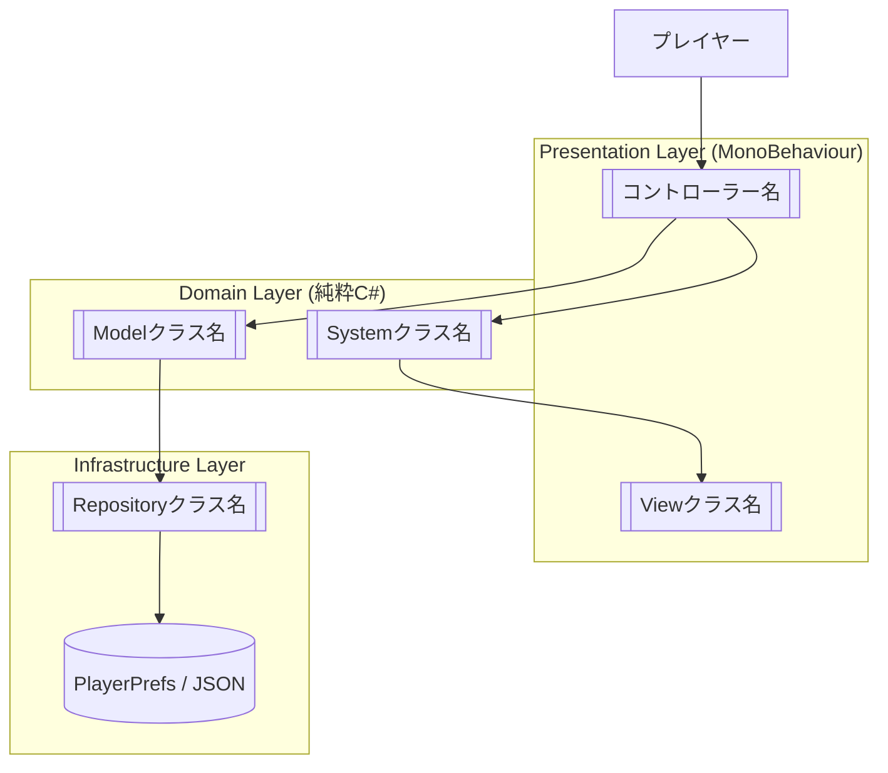
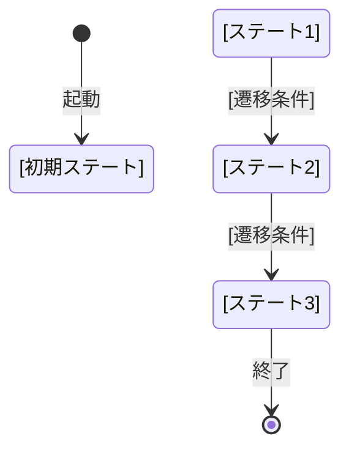
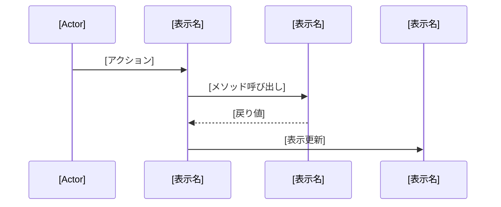
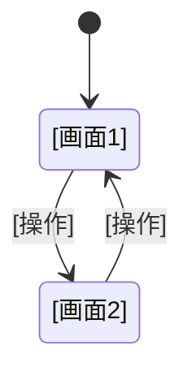

# 機能設計書 (Functional Design Document) - Unity

## システム構成図



---

## データモデル定義

### ゲームデータ（セーブ対象）

```csharp
[Serializable]
public class SaveData
{
    // [フィールド名]: [型]  // [説明・制約]
    public int PlayerLevel;       // プレイヤーレベル（1以上）
    public int HighScore;         // ハイスコア（0以上）
    public string LastPlayedAt;   // 最終プレイ日時（ISO 8601形式）
}
```

### ScriptableObject パラメータ定義

```csharp
[CreateAssetMenu(fileName = "[名称]Settings", menuName = "Game/[名称]Settings")]
public class [名称]Settings : ScriptableObject
{
    [Header("[カテゴリ]")]
    public [型] [パラメータ名] = [デフォルト値]; // [説明・単位]
    public [型] [パラメータ名] = [デフォルト値]; // [説明・単位]
}
```

**ScriptableObject一覧**:
| 名称 | 管理するパラメータ | 保存先 |
|---|---|---|
| [名称]Settings | [パラメータ内容] | Assets/Settings/ |

### 列挙型定義

```csharp
public enum GameState
{
    Idle,       // [説明]
    Playing,    // [説明]
    Paused,     // [説明]
    GameOver,   // [説明]
    Clear       // [説明]
}
```

---

## コンポーネント設計

### Presentation Layer（MonoBehaviour）

#### [コントローラークラス名]
**責務**:
- [責務1]
- [責務2]

**主要メソッド**:
```csharp
public class [クラス名] : MonoBehaviour
{
    void [メソッド名]([引数]); // [説明]
    void [メソッド名]([引数]); // [説明]
}
```

**依存するDomain層クラス**: [クラス名], [クラス名]

---

### Domain Layer（純粋C#）

#### [クラス名]
**責務**: [説明]

```csharp
public class [クラス名]
{
    [型] [プロパティ名] { get; }  // [説明]

    void [メソッド名]([引数]);    // [説明]
}
```

---

### Infrastructure Layer

#### [Repositoryクラス名]
**責務**: データの保存・読み込み

**保存先**: [PlayerPrefs / Application.persistentDataPath + JSON / その他]

```csharp
public class [クラス名]
{
    void Save([型] data);
    [型] Load();
    bool HasData();
}
```

---

## ゲームステートマシン



**ステート詳細**:

| ステート | 処理内容 | 遷移条件 |
|---|---|---|
| [ステート名] | [処理内容] | [遷移条件] |
| [ステート名] | [処理内容] | [遷移条件] |

---

## シーケンス図（主要ユースケース）

### [ユースケース名]



**フロー説明**:
1. [ステップ1]
2. [ステップ2]
3. [ステップ3]

---

## シーン階層（GameObject構成）

```
[Scene: シーン名]
├── [Manager] 管理オブジェクト群
│   ├── GameManager      : [説明]
│   └── [Manager名]      : [説明]
│
├── [Player]
│   ├── [Controller名]   : [説明]
│   └── [View名]         : [説明]
│
├── [UI]
│   ├── Canvas
│   │   ├── HUD          : [説明]
│   │   └── [Panel名]    : [説明]
│   └── EventSystem
│
└── [Stage]
    └── [要素名]          : [説明]
```

---

## UI設計

### 画面遷移図



### 画面別UI要素

| 画面 | UI要素 | 説明 |
|---|---|---|
| [画面名] | [要素名] | [説明] |
| [画面名] | [要素名] | [説明] |

---

## アルゴリズム設計（該当する場合）

### [アルゴリズム名]

**目的**: [説明]

**計算ロジック**:

```csharp
public class [クラス名]
{
    public [戻り値型] [メソッド名]([引数])
    {
        // ステップ1: [説明]
        var [変数] = [計算式];

        // ステップ2: [説明]
        var [変数] = [計算式];

        // 分類
        if ([条件]) return [結果1];
        if ([条件]) return [結果2];
        return [デフォルト結果];
    }
}
```

**パラメータ一覧**:
| パラメータ | 値 | 説明 |
|---|---|---|
| [名称] | [値] | [説明] |

---

## エラーハンドリング

| エラー種別 | 発生箇所 | 処理 | ユーザーへの表示 |
|---|---|---|---|
| セーブデータ破損 | 起動時 | 初期データで上書き | [メッセージ] |
| [エラー種別] | [発生箇所] | [処理] | [表示内容] |

---

## パフォーマンス考慮事項

- **オブジェクトプール対象**: [弾・エフェクト・敵など頻繁に生成するもの]
- **GCアロケーション削減**: [キャッシュ戦略]
- **ドローコール最適化**: [Sprite Atlasの使用など]

---

## テスト戦略（EditModeテストのみ）

**CLAUDE.md準拠: PlayModeテストは対象外。**

| テスト対象クラス | テストケース | 優先度 |
|---|---|---|
| [クラス名] | [正常系・境界値・異常系] | 高 |
| [クラス名] | [テストケース] | 中 |

**テスト実行**:
```bash
Unity -batchmode -runTests -testPlatform EditMode -projectPath . -testResults results.xml
```

---

## スコープ外

機能設計の対象外とする項目:
- [項目1]
- [項目2]
