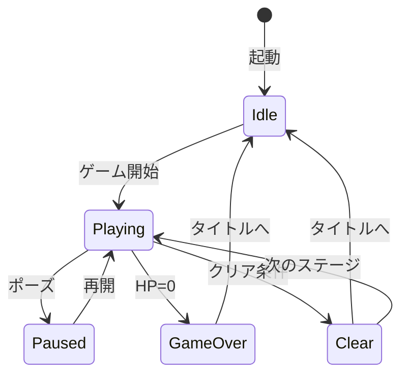

# 用語集作成ガイド - Unity

## 基本原則

### 1. 明確で一貫した定義

用語の定義は曖昧さを排除し、誰が読んでも同じ理解ができるようにします。

**悪い例**:
```markdown
## HpSystem
HPを管理するクラス
```

**良い例**:
```markdown
## HpSystem

**定義**: プレイヤーや敵のHP（ヒットポイント）を管理するDomain層の純粋C#クラス。

**説明**:
UnityEngine非依存で実装され、EditModeテストが可能。
現在HP・最大HP・死亡判定のプロパティと、ダメージ・回復のメソッドを持つ。

**関連用語**: [Domain層](#domain層), [EditModeテスト](#editモードテスト)

**実装箇所**: `Assets/Scripts/Sample/HpSystem.cs`

**使用例**:
- 「HpSystemでTakeDamageを呼び出す」: プレイヤーがダメージを受ける
- 「HpSystem.IsDeadがtrueの場合」: HPが0になりゲームオーバー処理へ
```

### 2. ゲーム用語とUnity技術用語を分ける

Unityゲームには「ゲームの世界の概念（HP、スコア、ステージ）」と「Unityの技術的概念（MonoBehaviour、Prefab、ScriptableObject）」の両方があります。カテゴリを明確に分けて定義します。

### 3. 具体例を含める

C#コードで使用例を示します。

**例**:
```markdown
## GameState（ゲームステート）

**定義**: ゲーム全体の進行状態を表す列挙型

**値の定義**:
| 値 | 意味 | 遷移元 | 遷移先 |
|---|---|---|---|
| `Idle` | 待機中（タイトル画面） | 起動時 | `Playing` |
| `Playing` | プレイ中 | `Idle` | `Paused`, `GameOver`, `Clear` |
| `Paused` | 一時停止 | `Playing` | `Playing` |
| `GameOver` | ゲームオーバー | `Playing` | `Idle` |
| `Clear` | クリア | `Playing` | `Idle`, `Playing` |

**実装**:
```csharp
// Assets/Scripts/Sample/GameState.cs
public enum GameState
{
    Idle,
    Playing,
    Paused,
    GameOver,
    Clear
}
```

**使用例**:
- 「GameStateがPlayingの時のみ入力を受け付ける」
- 「GameOverに遷移したらスコアを保存する」
```

### 4. 関連用語をリンクする

用語同士の関係性を明確にします。

```markdown
## Domain層

**定義**: [定義]

**関連用語**:
- [Presentation層](#presentation層): Domain層を呼び出す上位レイヤー
- [Infrastructure層](#infrastructure層): Domain層が呼び出す下位レイヤー
- [EditModeテスト](#editモードテスト): Domain層をテストする手段

**親子関係**:
- 依存される側: Presentation層から依存される
- 依存する側: Infrastructure層に依存する
```

---

## 用語の分類方法

### ゲーム用語の定義

**対象**: ゲームの世界観・ルール・メカニクスに関する概念

```markdown
## [ゲーム用語]

**定義**: [ゲームの文脈での1-2文の定義]

**説明**: [詳細な説明・ルール・制約]

**関連用語**: [関連する他の用語]

**ゲーム内での動作**: [プレイヤーが体験する動作]

**実装箇所**: [Domainクラス or ScriptableObject のパス]

**英語表記**: [English Term]（コード内の識別子と一致させる）
```

**例**:
```markdown
## コンボ (Combo)

**定義**: 連続して敵を倒した時に積み重なる連続撃破数

**説明**:
コンボ数は1体倒すごとに+1され、一定時間内に次の敵を倒さないとリセットされる。
コンボ数はスコア倍率に影響する。

**関連用語**:
- [スコア](#スコア): コンボ倍率がスコアに適用される
- [コンボタイマー](#コンボタイマー): コンボリセットまでの時間

**ゲーム内での動作**:
- コンボ継続中: 画面にコンボ数を表示
- コンボリセット時: コンボ数が0に戻る

**実装箇所**: `Assets/Scripts/Sample/ComboSystem.cs`

**英語表記**: Combo
```

---

### Unity技術用語の定義

**対象**: Unity・URP・C#の技術的な概念

```markdown
## [Unity技術用語]

**定義**: [技術的な説明]

**本プロジェクトでの用途**: [このプロジェクトでどう使っているか]

**使用箇所**: [ファイルパスまたはディレクトリ]

**公式ドキュメント**: [Unityマニュアルへの参照（URLは省略、項目名で記載）]

**注意点**: [よくある誤用・落とし穴]
```

**例**:
```markdown
## ScriptableObject

**定義**: MonoBehaviourを継承せずにデータを保持できるUnityのアセット型クラス

**本プロジェクトでの用途**:
ゲームパラメータ（HP上限、移動速度、ダメージ値など）の定義に使用する。
コードにマジックナンバーを書かず、インスペクターで調整可能にする。

**使用箇所**: `Assets/Settings/` ディレクトリ以下

**注意点**:
- ScriptableObjectはゲームロジック（メソッド）を持たせない（データ定義のみ）
- 実行時に値を変更すると全インスタンスに影響するため、ランタイムデータには使わない
- [Domain層](#domain層)とは分離し、パラメータ参照のみに使用する

**関連用語**:
- [Domain層](#domain層): ScriptableObjectの値を参照して使用する層
- [マジックナンバー](#マジックナンバー): ScriptableObjectで排除する対象
```

```markdown
## MonoBehaviour

**定義**: UnityのGameObjectにアタッチできるC#スクリプトの基底クラス

**本プロジェクトでの用途**:
Presentation層のコントローラー・Viewクラスの基底として使用。
Domain層には使用しない（EditModeテスト可能性を担保するため）。

**主要なライフサイクルメソッド**:
| メソッド | タイミング | 本プロジェクトでの使い方 |
|---|---|---|
| `Awake()` | GameObject有効化時（自己初期化） | コンポーネントキャッシュ、Domain層の初期化 |
| `Start()` | 最初のフレーム前（他オブジェクト参照） | 他GameObjectへの参照取得 |
| `Update()` | 毎フレーム | 入力受付・表示更新（GCアロケーション禁止） |
| `OnDestroy()` | GameObjectの削除時 | CancellationTokenSourceのDispose |

**注意点**:
- Domain層にMonoBehaviourを継承させてはいけない（[Domain層](#domain層)参照）
- `Update()`内でヒープアロケーション（`new class/List/string`）をしない

**関連用語**:
- [Presentation層](#presentation層): MonoBehaviourを使用する層
- [Domain層](#domain層): MonoBehaviourを使用しない層
```

---

### アーキテクチャ用語の定義

**対象**: このプロジェクトのレイヤー構成・設計パターンに関する概念

**例**:
```markdown
## Domain層

**定義**: ゲームロジックを実装する純粋C#クラス群。UnityEngineに依存しない。

**本プロジェクトでの適用**:
`Assets/Scripts/Sample/` 以下に配置。MonoBehaviour継承なし。
HpSystem、ScoreManager、GameStateManagerなどが該当する。

**メリット**:
- EditModeテストが可能（UnityEngine非依存のため）
- ゲームロジックの再利用性・移植性が高い
- Presentation層の変更がゲームロジックに影響しない

**依存関係のルール**:
```
Presentation層 → Domain層 → Infrastructure層

✅ Presentation → Domain（OK）
✅ Domain → Infrastructure（OK）
❌ Domain → Presentation（NG）
❌ Domain → UnityEngine名前空間（NG）
```

**実装箇所**: `Assets/Scripts/Sample/`（MonoBehaviourなしのクラス）

**関連用語**:
- [Presentation層](#presentation層): Domain層を呼び出す
- [Infrastructure層](#infrastructure層): Domain層が呼び出す
- [EditModeテスト](#editモードテスト): Domain層のテスト手段
```

---

### ゲームステート・状態の定義

**対象**: ゲームの進行状態・エンティティのステート

```markdown
## GameState（ゲームステート）

**定義**: ゲーム全体の進行状態

**取りうる値**:
| 値 | 意味 | 遷移条件 | 次の状態 |
|---|---|---|---|
| `Idle` | 待機中 | 起動時・ゲーム終了後 | `Playing` |
| `Playing` | プレイ中 | ゲーム開始 | `Paused`, `GameOver`, `Clear` |
| `Paused` | 一時停止 | ポーズボタン | `Playing` |
| `GameOver` | ゲームオーバー | HP=0 | `Idle` |
| `Clear` | クリア | クリア条件達成 | `Idle`, `Playing` |

**状態遷移図**:


**実装**:
```csharp
// Assets/Scripts/Sample/GameState.cs
public enum GameState { Idle, Playing, Paused, GameOver, Clear }
```
```

---

### エラー・例外の定義

**対象**: プロジェクトで使用するC#の例外

**例**:
```markdown
## ArgumentOutOfRangeException

**種別**: .NET標準例外

**発生条件**:
Domain層のメソッドに無効な引数（負のダメージ値など）が渡された時

**本プロジェクトでの使用**:
```csharp
// HpSystem.TakeDamage
if (damage < 0)
    throw new ArgumentOutOfRangeException(nameof(damage), "ダメージ値は0以上である必要があります");
```

**対処方法**:
- 呼び出し側がバリデーションを行い、不正な値を渡さないようにする
- Presentation層でtry-catchしてDebug.LogErrorを出力する

**関連用語**: [Domain層](#domain層), [HpSystem](#hpsystem)
```

---

### Unity固有の略語・頭字語

**例**:
```markdown
## URP

**正式名称**: Universal Render Pipeline

**意味**: Unityの軽量・クロスプラットフォーム対応のレンダリングパイプライン

**本プロジェクトでの使用**:
本プロジェクトのレンダリングパイプラインとして採用。
`Assets/Settings/` にPC / Mobile向け設定を分離して格納している。

**関連ドキュメント**: [アーキテクチャ設計書](./architecture.md#urp設定)

## GC（ガベージコレクション）

**正式名称**: Garbage Collection

**意味**: C#ランタイムによる自動メモリ管理。不要なヒープオブジェクトを自動回収する。

**本プロジェクトでの注意事項**:
Unity（C#のStop-the-worldGC）ではGC発生時にフレームが一時停止しスパイクが発生する。
`Update()`内でのヒープアロケーション（`new class/List/string`）を禁止している。

**関連ドキュメント**: [開発ガイドライン](./development-guidelines.md#gcアロケーション削減)
```

---

## 用語の保守・更新

### 用語追加のタイミング

**追加すべき時**:
- 新しいゲームメカニクス・システムが追加された
- 新しいUnityパッケージ・ライブラリを導入した
- チームメンバーから意味を聞かれた用語
- 各ドキュメントで3回以上登場する用語
- 命名の揺れが生じやすい用語（HP/ヒットポイント/体力など）

**追加不要な時**:
- C#・Unityの基本的な概念（変数、for文、GameObjectなど、公式Docで十分なもの）
- 1回しか使わない一時的な用語

### 更新のワークフロー

1. **用語の追加・変更**
   - 適切なカテゴリに追加
   - 定義項目を全て埋める
   - 関連用語をリンク

2. **影響範囲の確認**
   - 用語を使用しているドキュメント・コードを確認
   - 必要に応じてドキュメントを更新

3. **コミット**
   ```
   docs(glossary): [用語名]を追加
   ```

### 索引の管理

五十音順・アルファベット順に整理します。

```markdown
## 索引

### あ行
- [アセンブリ定義](#アセンブリ定義-asmdef) - Unity技術用語

### か行
- [コンボ](#コンボ-combo) - ゲーム用語

### さ行
- [ScriptableObject](#scriptableobject) - Unity技術用語

### た行
- [Domain層](#domain層) - アーキテクチャ用語

### A-Z
- [EditModeテスト](#editモードテスト) - 技術用語
- [GameState](#gamestate) - ゲーム用語・実装用語
- [GC](#gcガベージコレクション) - 略語
- [URP](#urp) - 略語
```

---

## チェックリスト

- [ ] ゲーム用語が明確に定義されている（ゲームの文脈での意味）
- [ ] Unity技術用語に本プロジェクトでの用途が記載されている
- [ ] アーキテクチャ用語（Presentation/Domain/Infrastructure層）が定義されている
- [ ] ゲームステートの状態遷移図がある
- [ ] C#の例外にプロジェクトでの使用例が含まれている
- [ ] 略語（URP、GCなど）に正式名称と本プロジェクトでの注意事項がある
- [ ] 関連用語がリンクされている
- [ ] 実装箇所（ファイルパス）が記載されている
- [ ] 索引が五十音・アルファベット順に整理されている
