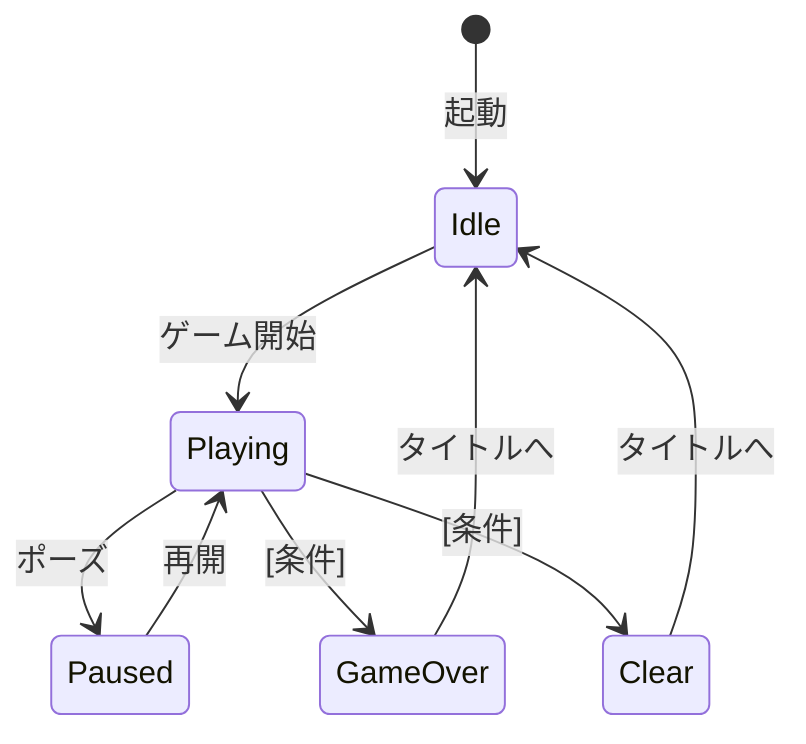

# プロジェクト用語集 (Glossary) - Unity

## 概要

このドキュメントは、Unityゲームプロジェクト内で使用される用語の定義を管理します。

**更新日**: [YYYY-MM-DD]

---

## ゲーム用語

ゲームの世界観・ルール・メカニクスに関する用語。

### [ゲーム用語1]

**定義**: [ゲームの文脈での1-2文の定義]

**説明**: [詳細な説明、ルール、制約]

**関連用語**: [関連する他の用語]

**ゲーム内での動作**:
- [動作1]
- [動作2]

**実装箇所**: `Assets/Scripts/Sample/[クラス名].cs`

**英語表記**: [English Term]

---

### [ゲーム用語2]

**定義**: [定義]

**説明**: [詳細]

**関連用語**: [関連用語]

---

## Unity 技術用語

Unity・URP・C#の技術的な概念。

### MonoBehaviour

**定義**: UnityのGameObjectにアタッチできるC#スクリプトの基底クラス

**本プロジェクトでの用途**:
Presentation層のコントローラー・Viewクラスの基底クラスとして使用する。
Domain層には使用しない（EditModeテスト可能性を担保するため）。

**主要なライフサイクルメソッド**:
| メソッド | タイミング | 本プロジェクトでの使い方 |
|---|---|---|
| `Awake()` | 自己初期化 | コンポーネントキャッシュ、Domain層の初期化 |
| `Start()` | 他オブジェクト参照が必要な初期化 | 他GameObjectへの参照 |
| `Update()` | 毎フレーム | 入力受付・表示更新（GCアロケーション禁止） |
| `OnDestroy()` | GameObject削除時 | CancellationTokenSource.Dispose |

**注意点**: Domain層にMonoBehaviourを継承させない

**関連用語**: [Presentation層](#presentation層), [Domain層](#domain層)

---

### ScriptableObject

**定義**: MonoBehaviourを継承せずにデータを保持できるUnityのアセット型クラス

**本プロジェクトでの用途**:
ゲームパラメータ（HP上限・移動速度・ダメージ値など）の定義に使用。
マジックナンバーを排除し、インスペクターで調整可能にする。

**使用箇所**: `Assets/Settings/` ディレクトリ以下

**注意点**:
- ゲームロジック（メソッド）を持たせない（データ定義のみ）
- ランタイムデータ（変化する値）には使用しない

**関連用語**: [Domain層](#domain層), [マジックナンバー](#マジックナンバー)

---

### [その他のUnity技術用語]

**定義**: [定義]

**本プロジェクトでの用途**: [用途]

**使用箇所**: [パス]

**注意点**: [注意点]

---

## アーキテクチャ用語

このプロジェクトのレイヤー構成・設計パターンに関する用語。

### Presentation層

**定義**: MonoBehaviourを継承するクラス群。プレイヤー入力の受付とDomain層の呼び出し、表示更新を担う。

**本プロジェクトでの適用**: `Assets/Scripts/Sample/` 以下のMonoBehaviour継承クラス

**許可される操作**: Domain層・Infrastructure層の呼び出し
**禁止される操作**: ゲームロジックの直接実装

**関連用語**: [Domain層](#domain層), [MonoBehaviour](#monobehaviour)

---

### Domain層

**定義**: ゲームロジックを実装する純粋C#クラス群。UnityEngineに依存しない。

**本プロジェクトでの適用**: `Assets/Scripts/Sample/` 以下のMonoBehaviourなしのクラス

**依存関係**:
```
Presentation層 → Domain層 → Infrastructure層

✅ Presentation → Domain（OK）
✅ Domain → Infrastructure（OK）
❌ Domain → Presentation（NG）
❌ Domain → UnityEngine名前空間（NG）
```

**メリット**: EditModeテストが可能

**関連用語**: [Presentation層](#presentation層), [Infrastructure層](#infrastructure層), [EditModeテスト](#editモードテスト)

---

### Infrastructure層

**定義**: データの保存・読み込みや外部サービス連携を担う層

**本プロジェクトでの適用**: PlayerPrefs・JSON（Application.persistentDataPath）を使用したRepository クラス

**関連用語**: [Domain層](#domain層), [SaveData](#savedata)

---

### [その他のアーキテクチャ用語]

**定義**: [定義]

**本プロジェクトでの適用**: [説明]

**関連コンポーネント**: [関連するコンポーネント]

---

## ゲームステート・状態

### GameState（ゲームステート）

**定義**: ゲーム全体の進行状態を表す列挙型

**取りうる値**:

| 値 | 意味 | 遷移条件 | 次の状態 |
|---|---|---|---|
| `Idle` | 待機中（タイトル） | 起動時・ゲーム終了後 | `Playing` |
| `Playing` | プレイ中 | ゲーム開始 | `Paused`, `GameOver`, `Clear` |
| `Paused` | 一時停止 | ポーズボタン | `Playing` |
| `GameOver` | ゲームオーバー | [遷移条件] | `Idle` |
| `Clear` | クリア | [遷移条件] | `Idle`, `Playing` |

**状態遷移図**:


**実装**: `Assets/Scripts/Sample/GameState.cs`

---

### [その他の状態定義]

| ステータス | 意味 | 遷移条件 | 次の状態 |
|---|---|---|---|
| [値] | [説明] | [条件] | [次の状態] |

---

## データモデル用語

C#クラス・ScriptableObjectで定義されるデータ構造。

### [クラス名]

**定義**: [クラスの説明]

**主要フィールド・プロパティ**:
```csharp
// Assets/Scripts/Sample/[クラス名].cs
public class [クラス名]
{
    public [型] [名前]; // [説明・制約]
    public [型] [名前]; // [説明・制約]
}
```

**制約**: [バリデーションルール]

**関連クラス**: [関連するクラス名]

---

## エラー・例外

プロジェクトで使用するC#例外の定義。

### [例外クラス名]

**種別**: [.NET標準例外 / プロジェクト固有例外]

**発生条件**: [どういう時に発生するか]

**本プロジェクトでの使用例**:
```csharp
// [発生箇所]
if ([条件])
    throw new [例外クラス名]([引数]);
```

**対処方法**:
- 呼び出し側: [バリデーション方法]
- Presentation層: [キャッチ・ログ出力方法]

---

## 略語・頭字語

### URP

**正式名称**: Universal Render Pipeline

**意味**: Unityの軽量・クロスプラットフォーム対応のレンダリングパイプライン

**本プロジェクトでの使用**:
`Assets/Settings/` にPC / Mobile向け設定を分離して格納している。

---

### GC

**正式名称**: Garbage Collection（ガベージコレクション）

**意味**: C#ランタイムによる自動メモリ管理

**本プロジェクトでの注意事項**:
`Update()`内でのヒープアロケーション禁止。GCスパイクによるフレームドロップを防ぐ。

---

### EditModeテスト

**正式名称**: Unity EditMode Test

**意味**: Unity Test Runnerで実行するEditModeのテスト。Unityを再生せずに実行可能。

**本プロジェクトでの使用**:
Domain層（純粋C#クラス）のテストに使用。PlayModeテストは対象外（CLAUDE.md参照）。

**実行方法**:
- Unity Test Runner: Window > General > Test Runner > EditMode
- CLI: `Unity -batchmode -runTests -testPlatform EditMode -projectPath . -testResults results.xml`

**関連用語**: [Domain層](#domain層)

---

### [その他の略語]

**正式名称**: [Full Name]

**意味**: [説明]

**本プロジェクトでの使用**: [説明]

---

## 索引

### あ行
- [アセンブリ定義 (.asmdef)](#アセンブリ定義-asmdef) - Unity技術用語

### か行
- [GameState](#gamestateゲームステート) - ゲームステート

### さ行
- [ScriptableObject](#scriptableobject) - Unity技術用語

### た行
- [Domain層](#domain層) - アーキテクチャ用語

### な行
- [Infrastructure層](#infrastructure層) - アーキテクチャ用語

### は行
- [Presentation層](#presentation層) - アーキテクチャ用語

### ま行
- [MonoBehaviour](#monobehaviour) - Unity技術用語

### A-Z
- [EditModeテスト](#editモードテスト) - 略語
- [GC](#gcガベージコレクション) - 略語
- [URP](#urp) - 略語
