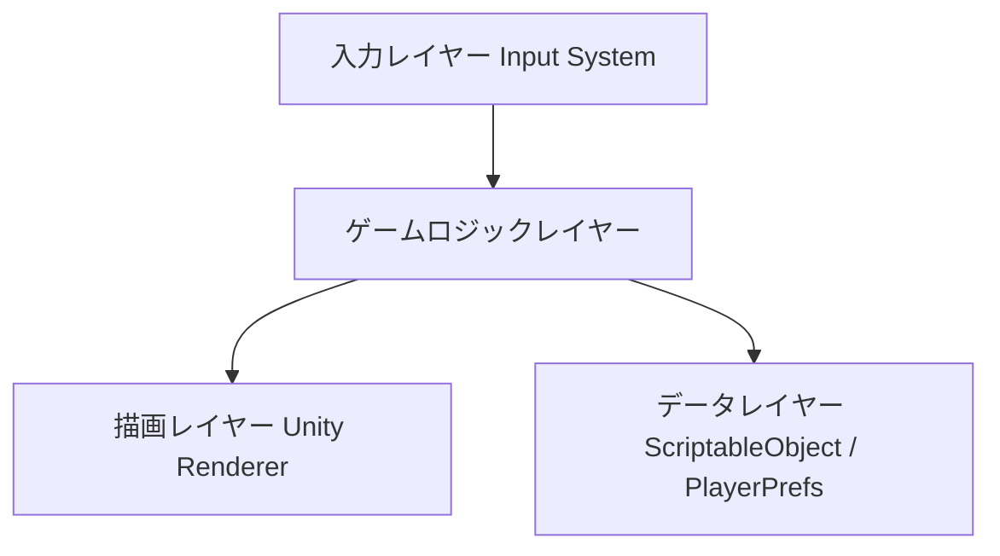
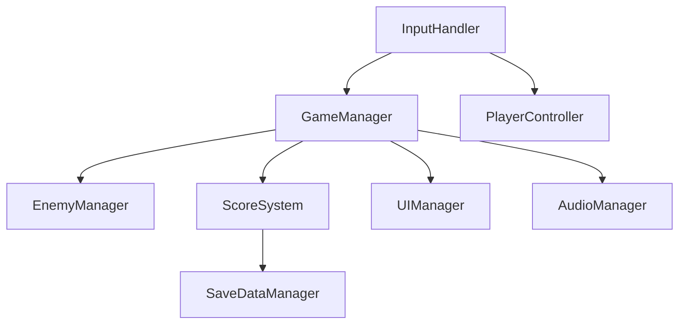
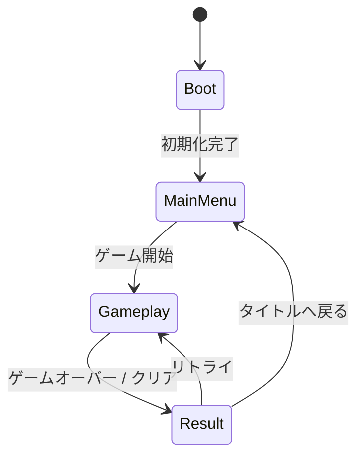
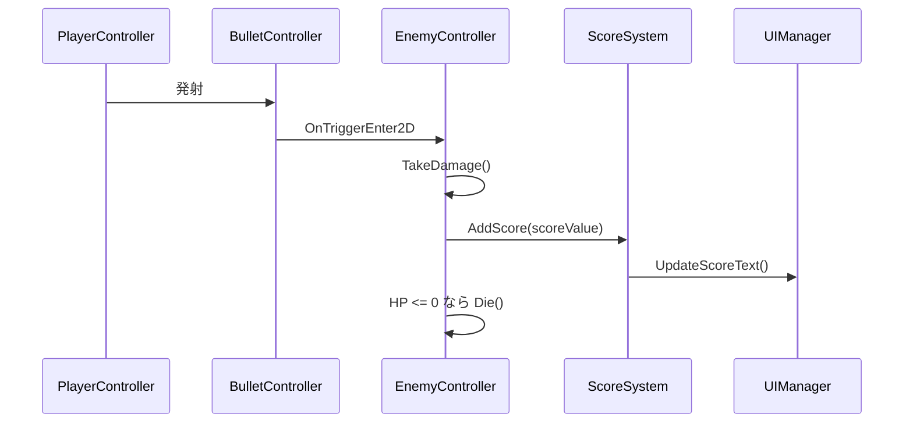
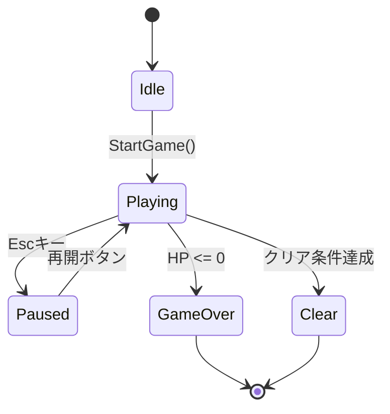

# 機能設計書作成ガイド

このガイドは、PRDに基づいてUnityゲームの機能設計書を作成するための実践的な指針です。

## 機能設計書の目的

PRDで定義された「何を作るか」を「Unityでどう実現するか」に落とし込むドキュメントです。

**主な内容**:
- システム構成図
- シーン設計
- データ設計（ScriptableObject・セーブデータ）
- コンポーネント設計（MonoBehaviour）
- ゲームフロー・State Machine
- UI設計
- エラーハンドリング

## 作成の基本フロー

### ステップ1: PRDの確認

機能設計書を作成する前に、必ずPRDを確認します。
```
Claude CodeにPRDから機能設計書を作成してもらう際のプロンプト例:

PRDの内容に基づいてUnityゲームの機能設計書を作成してください。
特に優先度P0(MVP)の機能に焦点を当ててください。
```

### ステップ2: システム構成図の作成

Unityゲームの典型的な構成をMermaid記法で記述します。

**基本構成の例**:


**より詳細な例**:


### ステップ3: シーン設計

#### シーン一覧と役割

| シーン名 | 役割 |
|----------|------|
| Boot | 初期化・マスターデータ読み込み |
| MainMenu | タイトル画面・設定 |
| Gameplay | メインゲームプレイ |
| Result | リザルト表示 |

#### シーン遷移図


### ステップ4: データ設計

#### ScriptableObjectの定義

ゲームパラメータはScriptableObjectで管理します。Inspector上で調整できるため、
コードを触らずにバランス調整が可能になります。
```csharp
[CreateAssetMenu(fileName = "EnemyData", menuName = "Data/Enemy")]
public class EnemyData : ScriptableObject
{
    public float _moveSpeed;    // 移動速度
    public int _maxHp;          // 最大HP
    public int _scoreValue;     // 撃破時のスコア
}
```

**重要なポイント**:
- ゲームバランスに関わる数値はすべてScriptableObjectに出す
- フィールドには必ずコメントで説明を追加
- `[Header]`や`[Range]`属性でInspectorを整理する

#### セーブデータの定義
```csharp
[Serializable]
public class SaveData
{
    public int _highScore;          // ハイスコア
    public bool _isTutorialDone;    // チュートリアル完了フラグ
}
```

**保存方法の選択基準**:
- 小規模（スコア・フラグ程度）: `PlayerPrefs`
- 中規模（複数のデータ構造）: `JsonUtility` + ファイル保存

### ステップ5: コンポーネント設計

各MonoBehaviourの責務を明確にします。1つのMonoBehaviourに多くの責務を持たせないことが重要です。

**責務の分け方の基本**:
- 入力受付 → `InputHandler`
- キャラクター制御 → `PlayerController` / `EnemyController`
- ゲーム進行管理 → `GameManager`
- UI表示 → `UIManager`
- 音声再生 → `AudioManager`
- セーブ・ロード → `SaveDataManager`

**記述フォーマット**:
```csharp
public class PlayerController : MonoBehaviour
{
    [SerializeField] private PlayerData _playerData;
    [SerializeField] private Rigidbody2D _rb;

    public void Move(Vector2 direction) { }
    public void TakeDamage(int damage) { }
}
```

**各コンポーネントには以下を明記する**:
- アタッチ先のGameObject名・階層
- SerializeFieldで外部から注入するもの
- publicメソッドのシグネチャ
- 依存する他のコンポーネント

### ステップ6: ゲームフロー設計

#### ゲームプレイシーケンス

主要なゲームプレイの流れをシーケンス図で表現します。

**例: プレイヤーが敵にダメージを与えるフロー**:


#### ゲーム状態管理（State Machine）

GameManagerで管理するゲーム状態を定義します。

```csharp
public enum GameState
{
    Idle,
    Playing,
    Paused,
    GameOver,
    Clear
}
```

### ステップ7: 当たり判定設計（該当する場合）

Layer設定はUnityの物理演算コストに直結するため、早めに設計します。

#### コライダー設定

| オブジェクト | コライダー種別 | Layer | Tag |
|-------------|--------------|-------|-----|
| Player | CapsuleCollider2D | Player | Player |
| 敵 | CircleCollider2D | Enemy | Enemy |
| 弾 | CircleCollider2D | Bullet | Bullet |
| 地形 | CompositeCollider2D | Ground | - |

#### Layer Collision Matrix

不要な衝突判定をOFFにすることでパフォーマンスを改善できます。

| | Player | Enemy | Bullet | Ground |
|-|--------|-------|--------|--------|
| Player | ❌ | ✅ | ❌ | ✅ |
| Enemy | ✅ | ❌ | ✅ | ✅ |
| Bullet | ❌ | ✅ | ❌ | ✅ |
| Ground | ✅ | ✅ | ✅ | ❌ |

### ステップ8: アルゴリズム設計（該当する場合）

複雑なゲームロジックは擬似コードと数式で詳細に設計します。

**例: スコア計算アルゴリズム**

**目的**: 撃破数・残り時間・コンボ数からスコアを計算する

**計算ロジック**:

#### 基本スコア
- 計算式: `baseScore = 敵の基礎スコア値 × コンボ倍率`
- コンボ倍率: `1.0 + (コンボ数 × 0.1)`（上限5.0倍）

#### タイムボーナス
- 計算式: `timeBonus = 残り時間(秒) × 10`

#### 最終スコア
- 計算式: `finalScore = baseScore + timeBonus`

**実装例**:
```csharp
private int CalculateScore(int baseValue, int comboCount, float remainingTime)
{
    var comboMultiplier = Mathf.Min(1.0f + comboCount * 0.1f, 5.0f);
    var baseScore = Mathf.RoundToInt(baseValue * comboMultiplier);
    var timeBonus = Mathf.RoundToInt(remainingTime * 10);
    return baseScore + timeBonus;
}
```

### ステップ9: UI設計

#### 画面一覧

| 画面名 | Prefab名 | 表示タイミング |
|--------|----------|--------------|
| HUD | HUDCanvas | ゲームプレイ中は常時表示 |
| ポーズ画面 | PauseCanvas | Escキー押下時 |
| ゲームオーバー画面 | GameOverCanvas | GameOver状態遷移時 |
| リザルト画面 | ResultCanvas | Clear状態遷移時 |

#### UI要素定義

**HUD**:
| 要素 | 種別 | 更新タイミング |
|------|------|--------------|
| スコア表示 | TextMeshProUGUI | スコア加算時 |
| HP表示 | Slider | ダメージ時 |
| 残り時間 | TextMeshProUGUI | 毎フレーム |
| コンボ数 | TextMeshProUGUI | コンボ変化時 |

### ステップ10: オーディオ設計

#### AudioMixer構成
```
Master
├── BGM
└── SE
```

#### SE一覧

| SE名 | ファイル名 | 再生タイミング |
|------|-----------|--------------|
| 攻撃 | attack.wav | 攻撃アクション時 |
| ダメージ | damage.wav | ダメージ受けた時 |
| 敵撃破 | enemy_dead.wav | 敵のHPが0になった時 |
| ゲームオーバー | gameover.wav | GameOver状態遷移時 |

### ステップ11: エラーハンドリング

| エラー種別 | 発生条件 | 対処 |
|-----------|---------|------|
| セーブデータ読み込み失敗 | ファイル破損・初回起動 | デフォルト値で初期化して続行 |
| ScriptableObject未設定 | Inspectorの設定漏れ | Debug.LogErrorで警告・ゲーム停止 |
| シーン遷移失敗 | シーン名のタイポ等 | Debug.LogErrorで原因を出力 |

## 機能設計書のレビュー

### レビュー観点
```
この機能設計書を評価してください。以下の観点で確認してください:

1. PRDのP0機能がすべて設計に含まれているか
2. MonoBehaviourの責務が適切に分離されているか
3. ScriptableObjectで外出しすべきパラメータが漏れていないか
4. State Machineの状態遷移に漏れ・矛盾がないか
5. 当たり判定のLayer設定が正しく設計されているか
```

## まとめ

機能設計書作成の成功のポイント:

1. **PRDとの整合性**: PRDで定義されたP0機能を正確に反映する
2. **Mermaid記法の活用**: シーン遷移・State Machine・シーケンス図を図表で表現する
3. **ScriptableObjectで数値を外出し**: バランス調整しやすい設計にする
4. **MonoBehaviourの責務を1つに絞る**: 巨大なGameManagerを作らない
5. **Layer設計を早めに決める**: 後から変更するとコストが高い