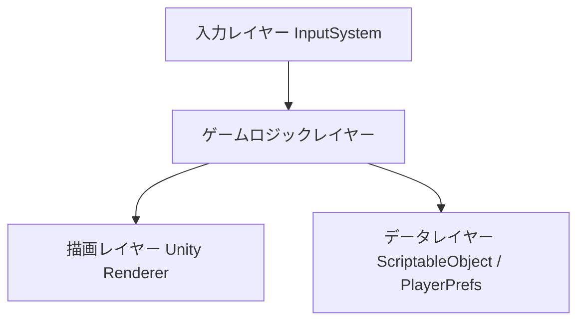
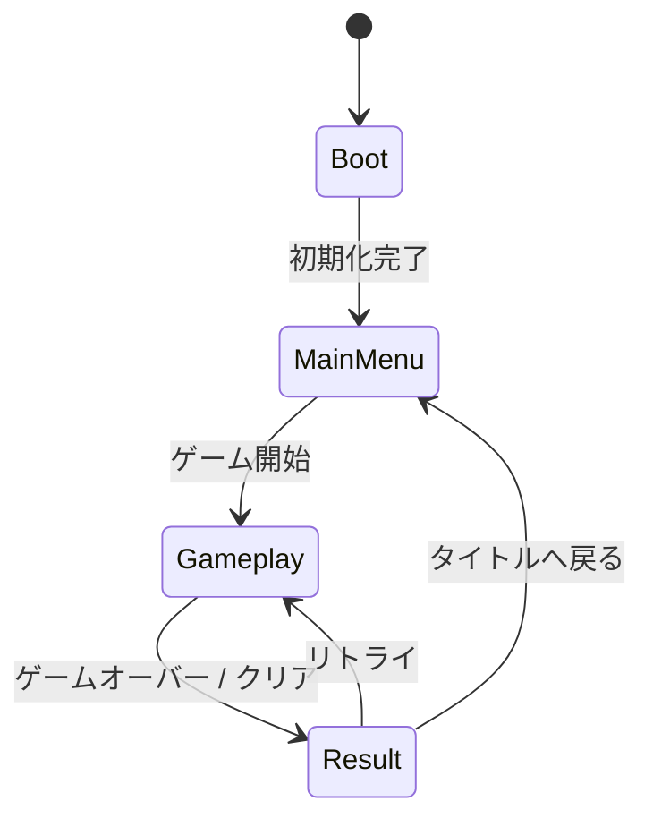
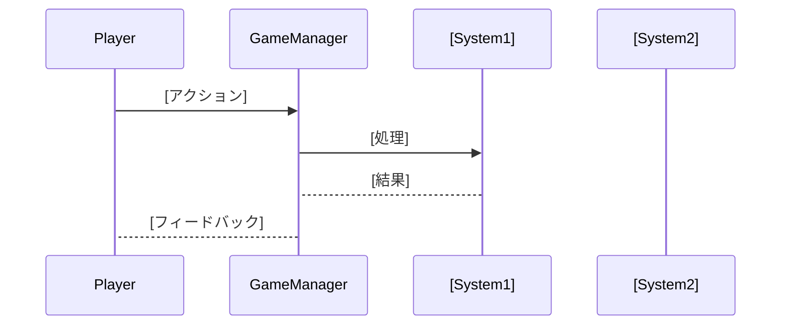
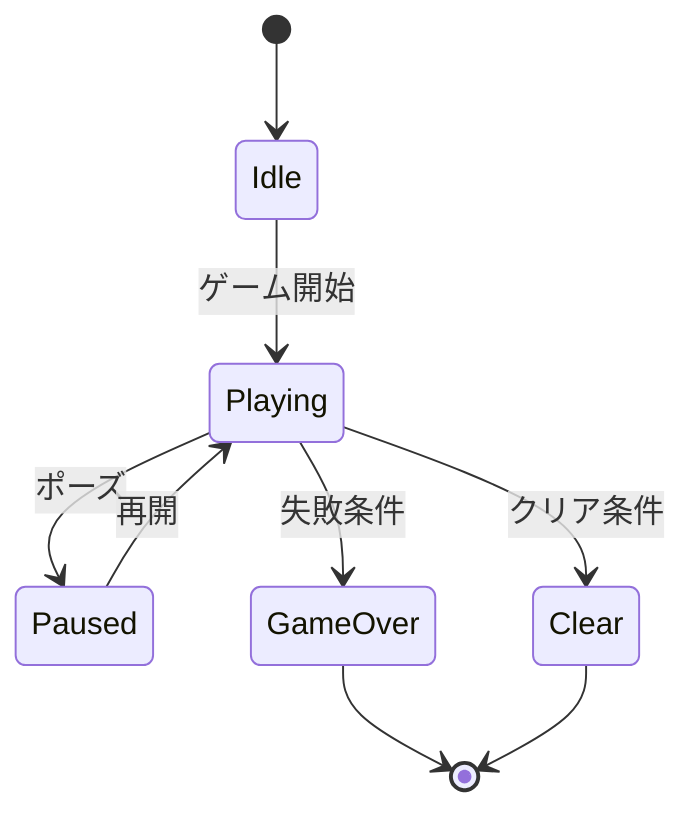

# 機能設計書 (Functional Design Document)

## システム構成図


## 技術スタック

| 分類 | 技術 | 選定理由 |
|------|------|----------|
| エンジン | Unity [バージョン] | - |
| レンダーパイプライン | URP / Built-in | [理由] |
| 言語 | C# | - |
| 入力 | Input System / Legacy Input | [理由] |
| データ管理 | ScriptableObject / PlayerPrefs / JSON | [理由] |
| 音声 | Unity AudioMixer | - |

## シーン設計

### シーン一覧

| シーン名 | 役割 |
|----------|------|
| Boot | 初期化・マスターデータ読み込み |
| MainMenu | タイトル画面・設定 |
| Gameplay | メインゲームプレイ |
| Result | リザルト表示 |

### シーン遷移図


## データ設計

### ScriptableObject定義
```csharp
// ゲームパラメータ例
[CreateAssetMenu(fileName = "[Name]Data", menuName = "Data/[Name]")]
public class [Name]Data : ScriptableObject
{
    public [type] [field1]; // [説明]
    public [type] [field2]; // [説明]
}
```

### セーブデータ定義
```csharp
[Serializable]
public class SaveData
{
    public [type] [field1]; // [説明]
    public [type] [field2]; // [説明]
}
```

**保存方法**: PlayerPrefs(小規模) / JSONファイル(中規模)

## コンポーネント設計

### [コンポーネント名]

**役割**: [このMonoBehaviourが担う責務]

**アタッチ先**: [GameObjectの名前・階層]
```csharp
public class [ComponentName] : MonoBehaviour
{
    [SerializeField] private [type] _[field1]; // [説明]
    [SerializeField] private [type] _[field2]; // [説明]

    public void [Method1]([params]) { }
    public void [Method2]([params]) { }
}
```

**依存コンポーネント**:
- [依存先1]
- [依存先2]

## ゲームフロー設計

### ゲームプレイシーケンス


### ゲーム状態管理 (State Machine)


## 当たり判定設計（該当する場合）

### コライダー設定

| オブジェクト | コライダー種別 | Layer | Tag |
|-------------|--------------|-------|-----|
| [Object1] | [BoxCollider2D等] | [Layer名] | [Tag名] |
| [Object2] | [CircleCollider等] | [Layer名] | [Tag名] |

### Layer Collision Matrix

| | [Layer1] | [Layer2] | [Layer3] |
|-|----------|----------|----------|
| [Layer1] | - | ✅ | ❌ |
| [Layer2] | ✅ | - | ✅ |
| [Layer3] | ❌ | ✅ | - |

## UI設計

### 画面一覧

| 画面名 | Prefab名 | 表示タイミング |
|--------|----------|--------------|
| [画面1] | [名前]Canvas | [タイミング] |
| [画面2] | [名前]Canvas | [タイミング] |

### UI要素定義

**[画面名]**:
| 要素 | 種別 | 説明 |
|------|------|------|
| [要素1] | Text / Button / Slider | [説明] |
| [要素2] | Text / Button / Slider | [説明] |

## アルゴリズム設計（該当する場合）

### [アルゴリズム名]

**目的**: [説明]

**計算ロジック**:
- 計算式: `[式]`
- 入力範囲: [範囲]
- 出力範囲: [範囲]

**実装例**:
```csharp
private [returnType] [AlgorithmName]([params])
{
    // ステップ1
    var [result1] = [calculation];

    // ステップ2
    var [result2] = [calculation];

    return [result];
}
```

## オーディオ設計

### AudioMixer構成
```
Master
├── BGM
└── SE
```

### SE一覧

| SE名 | ファイル名 | 再生タイミング |
|------|-----------|--------------|
| [SE1] | [filename].wav | [タイミング] |
| [SE2] | [filename].wav | [タイミング] |

## パフォーマンス設計

- [対策1]: [説明] (例: オブジェクトプールで弾の生成コストを削減)
- [対策2]: [説明] (例: TextMeshProでドローコールをバッチング)

## エラーハンドリング

| エラー種別 | 発生条件 | 対処 |
|-----------|---------|------|
| [種別1] | [条件] | [対処内容] |
| [種別2] | [条件] | [対処内容] |

## テスト方針

### 動作確認項目
- [ ] [確認項目1]
- [ ] [確認項目2]

### プレイテスト基準
- [ ] [基準1] (例: 意図した難易度でゲームオーバーが発生する)
- [ ] [基準2] (例: フレームレートが常時60fpsを維持する)